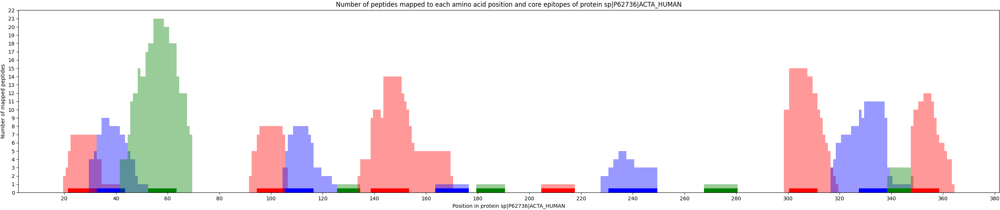

# localplateau 
This tool is an adaption from [plateau](https://plateau.bcp.fu-berlin.de/).

## General purpose
The tool can be used to identify and quantify shared consensus epitopes. 

### How to use
1. In your command line go to the directory where this github repository is cloned to.
2. Specify your input as described [here](#Input-files).
3. Activate the python or conda environment with
    ```bash
    # python environment
    source <PATH_TO_ENV>/bin/activate

    # conda environment
    conda activate localplateau
    ```
4. To compute the consensus epitopes enter the following command:
    ```bash
    python3 plateau_main.py <PROTEOME_FILE> params.yaml generate-plateau-csv <EVIDENCE_FILE>
    ```
    Replace ```EVIDENCE_FILE``` with the path to your evidence file and ```PROTEOME_FILE``` with the path to the proteome FASTA file, that was used to generate the evidence file. You can find more detailed information about the input data [here](#input-files).  

   To visualize the landscape of a protein you can use the following command:
    ```bash
    python3 plateau_main.py <PROTEOME_FILE> params.yaml plot-landscape <PLATEAU_RESULT>
    ```
    Replace ```PLATEAU_RESULT``` with the file plateau_result.csv, which can be generated by using the generate-plateau-csv command. 

### First time set up 
#### Clone the localplateau repository 
```bash 
git clone git@github.com:AG-Walz/localplateau.git
```
#### Create an environment for localplateau
You can either set up a python or a conda environment. 

##### Create a python environment
First install python (version >=3.12), if it is not installed on your system yet. If you have a working installation run the following commands:
```bash
# create the environment
python3 -m venv plateau

# activate the environment
source plateau/bin/activate

# install all dependencies of localplateau
pip install pyproject.toml
```

###### Create a conda environment
If miniconda is not installed on your system yet, install it by running the following commands:
```bash
mkdir -p ~/miniconda3
wget https://repo.anaconda.com/miniconda/Miniconda3-latest-Linux-x86_64.sh -O ~/miniconda3/miniconda.sh
bash ~/miniconda3/miniconda.sh -b -u -p ~/miniconda3
rm ~/miniconda3/miniconda.sh
source .bashrc
```

After a successful installation of miniconda the conda environment can be created and activated by executing the following commands. 
```bash
conda env create -f environment.yml 
conda activate localplateau
```


### Input files
#### params.yaml
In the params.yaml file the input parameters can be specified. The file should look like this:
```
parameters:
  seq_column: 
  protacc_column: 
  intensity_column:
  start_column: 
  end_column: 
  out_dir: 
  mod_pattern: 
  delimiter: 
  prot_accession: 
  min_overlap: 
  max_step_size: 
  min_epi_length: 
```
The description of each parameter can be found in the table below. Parameters enclosed in square brackets are optional.  Parameters highlighted with 🟢 are necessary for the plot-landscape command. Parameters highlighted with 🔴 are necessary for the generate-plateau-csv command. An example params.yaml file can be found [here](params.yaml).
| Parameter | Description |
| --- | --- |
| 🔴 max_step_size | Defines the maximal step size between two peptides to still be grouped to the same epitope. If the start positions of two peptides differ by that number, the peptides are only grouped together if they overlap by a minimum of min_overlap amino acids.|
| 🔴 min_overlap | Defines the minimal overlap between two epitopes to still be grouped to the same epitope, if the start positions of the epitopes differ more than max_step_size.|
| 🔴 min_epi_length | Defines the minimum epitope length. This is the minimal length a core epitope has to have. If for a epitope the whole sequence of the epitope is shorter than the minimum epitope length, the core will be defined as the whole sequence.| 
| 🔴 seq_column | Defines the column header in the input evidence file that contains the peptide sequences. |
| 🔴 protacc_column | Defines the column header in the input evidence file that contains the protein accessions of proteins that contain the peptide of the row. |
| [start_column] | This is an optional parameter. It defines the column header in the input evidence file that contains the start position of the peptide in the different proteins. Setting this parameter reduces the runtime. |
| [end_column] | This is an optional parameter. It defines the column header in the input evidence file that contains the end position of the peptide in the different proteins. Setting this parameter reduces the runtime.|
| [intensity_column] | This is an optional parameter. It defines the column header in the input evidence file of the column that contains the intensity of a peptide sequence. |
| 🔴 out_dir | Defines the directory in which the results will be saved. |
| [mod_pattern] | Defines how modifications in the peptides are separated from the sequence. Provide a comma-separated string here, where the first element specifies the start of a modification and the second element defines the end of a modification. Everything inside () and [] is interpreted as a modification by default.|
| 🔴 delimiter | Defines the delimiter that separates multiple values in one cell in the input evidence file. |
| 🟢 prot_accession | Defines the proteins for which the core epitopes and landscape should be visualized. Separate multiple parameters with commas. |

#### evidence file
The evidence file is the output file of a search engine. The following file types are supported: csv, tsv, xlsx.

#### proteome file
The proteome file should contain the proteome used for the identification of the peptide sequences. The file should follow the FASTA format. 


### Output files
The generate-plateau-csv command results in three csv files ([epitopes.csv](#epitopescsv), [plateau_result.csv](#plateau_resultcsv), [evidence_link_group.csv](#evidence_link_groupcsv)) and one html report. 

The plot-landscape command results in protein landscape visualizations. One example can be found [here](#landscape-visualization). The number of plots is defined by the number of accessions provided in the params.yaml file.

#### epitopes.csv
The csv contains one epitope per row. 
| column | description |
| --- | --- |
| whole_epitopes | The sequence of the entire epitope. |
| consensus_epitopes | The sequence of the core epitope. |
| landscape | The landscape of the epitope. |
| grouped_peptides_sequence | A list containing the peptide sequences that contribute to the epitope. |
| relative_core_intensity | The relative core intensity of the epitope. The relative intensity of an epitope is the intensity of the epitope divided by the sum of all intensities in the provided evidence file.|
| core_epitopes_intensity | The total core intensity of the epitope. The intensity of an epitope is computed as the sum of the intensities of peptides that contribute to that epitope.|
| accession | A list containing the accessions of proteins in which the epitope occurs. |


#### plateau_result.csv
The csv contains one protein per row. The different columns contain the following information: 
| column | description |
| --- | --- |
| accession | The protein accession. |
| sequence | A list of sequences of peptides mapped to the protein. |
| start | A list containing the start positions of the peptides in the protein. | 
| end | A list containing the end positions of the peptides in the protein. | 
| grouped peptides start | The start positions of all peptides grouped together to epitopes. |
| grouped peptides end | The end positions of all peptides grouped together to epitopes. | 
| grouped peptides sequence | The peptide sequences that contribute to the same epitope grouped together. |
| sequence group mapping | A list mapping each peptide onto it's epitope.| 
| core_epitopes_intensity | A list containing the intensity of each epitope. The intensity of an epitope is computed as the sum of the intensities of peptides that contribute to that epitope.|
| relative_core_intensity | A list containing the relative intensity of each epitope. The relative intensity of an epitope is the intensity of the epitope divided by the sum of all intensities in the provided evidence file. |
| landscape | A list containing the landscapes of each epitope. | 
| whole epitopes | A list containing the whole epitopes. | 
| core epitopes | A list containing the core epitopes. | 
| core epitopes start | A list containing the start positions of the cores in the protein. |
| core epitopes end |  A list containing the start positions of the cores in the protein. |

#### evidence_link_group.csv
The evidence_link_group.csv contains all the information from the initial evidence file. In addition there the following columns:
| column | description |
| --- | --- |
| whole_epitopes | A list of all sequences of epitopes to which the peptide of the row contributes.|
| core_epitopes | A list of all core sequences of epitopes to which the peptide of the row contributes.|
| proteome_occurrence | A list containing protein accessions and sequence positions at which the core epitope occurs in the proteome. |
| total_core_intensity | A list containing the intensity of each epitope. The intensity of an epitope is computed as the sum of the intensities of peptides that contribute to that epitope. |
| relative_core_intensity | A list containing the relative intensity of each epitope. The relative intensity of an epitope is the intensity of the epitope divided by the sum of all intensities in the provided evidence file.|

#### report.html
The report file summarizes some of the results. Among other things it includes two histograms visualizing the peptide and epitope length distribution and shows the ten epitopes with the highest number of mapped peptides.

#### landscape visualization
An example landscape visualization of a protein generated with the plot-landscape command:

The height indicates how many peptides are mapped to a position in the proteome. The different colors indicate different epitopes. Lighter areas of a color indicate how many peptides are associated with the epitope. The more intense region indicate the core epitope. 


## Workflow
1. Identification of the location of all peptides in the proteome.
2. Group peptides whose start position does not differ by more than max_step_size amino acids or whose overlap is larger than min_overlap. max_step_size and min_overlap are parameters that can be specified by the user.
3. Identify epitope sequences,V as the sequence of each peptide group.
4. For each peptide sequence, identify the core epitope sequence. The core epitope sequence is defined as the sequence region that has the highest peptide mapping count while having a minimum length of min_epi_length amino acids.

