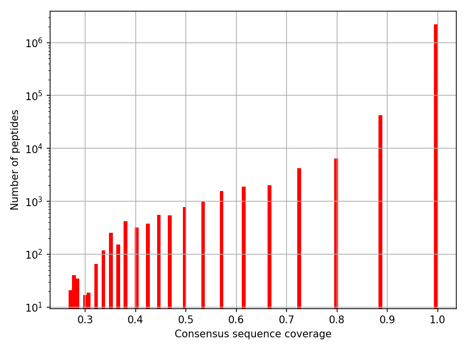
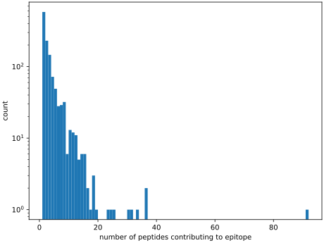
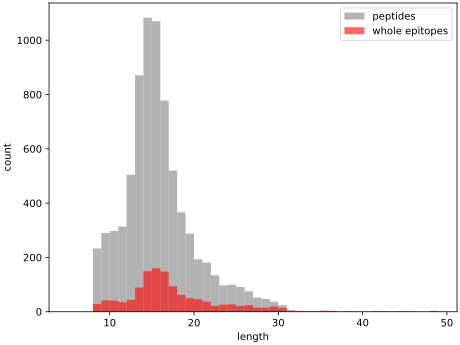
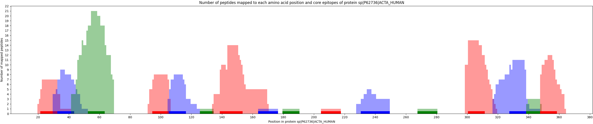

# epicore
This tool is an adaption from [plateau](https://plateau.bcp.fu-berlin.de/).

## General purpose
The tool can be used to identify shared consensus epitopes. 


## Installation
[](https://test.pypi.org/project/epicore/)
```bash
pip install epicore
```

Follow the [conda docs](https://github.com/AG-Walz/docs/tree/main/conda) to install conda. <br>

```bash
conda install bioconda::epicore
```

## How to use
To compute the consensus epitopes enter the following command:
```bash
epicore --reference_proteome <PROTEOME_FILE> --out_dir <OUT_DIR> generate-epicore-csv --min_epi_length <MIN_EPI_LENGTH> --min_overlap <MIN_OVERLAP> --max_step_size <MAX_STEP_SIZE> --seq_column <SEQ_COLUMN> --protacc_column <PROTACC_COLUMN> --delimiter <DELIMITER> --evidence_file <EVIDENCE_FILE> --start_column <START_COLUMN> --end_column <END_COLUMN> --sample_column <SAMPLE_COLUMN>--condition_column <CONDITION_COLUMN> [--strict]
```

Replace ```<EVIDENCE_FILE>``` with the path to your evidence file and ```<PROTEOME_FILE>``` with the path to the proteome FASTA file, that was used to generate the evidence file. You can find more detailed information about the input data [here](#input).  

To visualize the landscape of a protein you can use the following command:
```bash
epicore --reference_proteome <PROTEOME_FILE> --out_dir <OUT_DIR> plot-landscape --epicore_csv <EPICORE_RESULT> --protacc <PROTACC>
```
Replace ```<EPICORE_RESULT>``` with the file epicore_result.csv, which can be generated by using the generate-epicore-csv command. 

### Input 
The description of each parameter can be found in the table below. Parameters enclosed in square brackets are optional. Parameters highlighted with 🟢 are necessary for the plot-landscape command. Parameters highlighted with 🔴 are necessary for the generate-epicore-csv command. The tool supports any output that contains a sequence, protein accession, start and end position column. 
| Parameter | Description |
| --- | --- |
| 🔴 max_step_size | Parameter used for the grouping of the peptides into peptide groups. |
| 🔴 min_overlap | Parameter used for the grouping of the peptides into peptide groups.|
| 🔴 min_epi_length | Parameter used for the grouping of the peptides into peptide groups.| 
| 🔴 seq_column | Defines the column header in the input evidence file that contains the peptide sequences. |
| 🔴 protacc_column | Defines the column header in the input evidence file that contains the protein accessions of proteins that contain the peptide of the row. |
| 🔴 start_column | Defines the column header in the input evidence file that contains the start positions of the peptide of the row.|
| 🔴 end_column | Defines the column header in the input evidence file that contains the end positions of the peptide of the row.|
| 🔴 sample_column | Defines the column header in the input evidence file that contains the sample of the peptide of the row.|
| 🔴 condition_column | Defines the column header in the input evidence file that contains the condition of the peptide of the row.|
| 🔴 out_dir | Defines the directory in which the results will be saved. |
| 🔴 delimiter | Defines the delimiter that separates multiple values in one cell in the input evidence file. |
| [mod_pattern] | Defines how modifications of a peptide are separated from the sequence in the sequence column. Provide a comma-separated string here, where the element before the comma specifies the start of a modification and the element after the comma defines the end of a modification in the sequences of the sequence column. If the sequences in the sequence column include modifications they are separated by delimiters. In AAAPAIM/+15.99\SY for example the modification is separated by / and \ . The mod_pattern parameter should be  ```/,\``` in that case. All parts of a sequence inside () and [] are interpreted as modifications by default. If these delimiters are used in your input file, you do not need to provide a mod_delimiter parameter.|
| [strict] | If set a strict version is run. The strict version ensures the defined minimal overlap is given between all peptides in a peptide group. |
| [html] | If set to a html version of the generated plots gets computed.|
| 🟢 protacc | Defines the proteins for which the core epitopes and landscape should be visualized. Separate multiple parameters with commas. |

#### evidence file
The evidence file is the output file of a search engine. The following file types are supported: csv, tsv, xlsx.

#### proteome file
The proteome file should contain the proteome used for the identification of the peptide sequences. The file should follow the FASTA format. It should contain all proteins that appear in the protein accession column of the evidence file.


### Output files
```
results of generate-epicore-csv
  |_consensus_sequence_coverage.png
  |_coverage.csv
  |_epicore.log
  |_epicore_result.csv
  |_epitope_intensity_hist.svg
  |_epitopes.csv
  |_length_distributions.svg
  |_pep_cores_mapping.tsv
```
The plot-landscape command results in protein landscape visualizations. One example can be found [here](#landscape-visualization). The number of plots is defined by the number of accessions provided in the params.yaml file.

#### epicore.log
The log file contains information about the run. It lists all peptides that were removed since their proteins do not appear in the reference proteome. It also includes the number of identified consensus sequences and the average consensus sequence coverage.

#### epitopes.csv
The csv contains one epitope per row. 
| column | description |
| --- | --- |
| whole_epitopes | The sequence of the entire peptide group. |
| consensus_epitopes | The identified consensus sequence. |
| landscape | The landscape of the epitope. |
| grouped_peptides_sequence | A list containing the peptide sequences that contribute to the epitope. |
| grouped_peptides_sample | A list containing the samples of the peptides from the grouped_peptides_sequence column. |
| grouped_peptides_condition | A list containing the conditions of the peptides from the grouped_peptides_sequence column. |
| grouped_peptides_start | A list containing the start positions of the peptides from the grouped_peptides_sequence column. |
| grouped_peptides_end | A list containing the end positions of the peptides from the grouped_peptides_sequence column. |
| core_epitopes_start | The start position of the consensus sequence.|
| core_epitopes_end | The end position of the consensus sequence.|
| accession | A list containing the accessions of proteins in which the epitope occurs. |


#### epicore_result.csv
The csv contains one protein per row. The different columns contain the following information: 
| column | description |
| --- | --- |
| accession | The protein accession. |
| sequence | A list of sequences of peptides mapped to the protein. |
| start | A list containing the start positions of the peptides in the protein. | 
| end | A list containing the end positions of the peptides in the protein. | 
| peptide_index | A list containing the row number of the peptides in the evidence file. | 
| sample | A list containing the sample of the peptides in the protein. | 
| condition | A list containing the condition of the peptides in the protein. | 
| grouped peptides start | The start positions of all peptides grouped together to epitopes. |
| grouped peptides end | The end positions of all peptides grouped together to epitopes. | 
| grouped peptides sequence | The peptide sequences that contribute to the same epitope grouped together. |
| grouped peptides sample | The samples of all peptides grouped together to epitopes. | 
| grouped peptides condition | The conditions of all peptides grouped together to epitopes. | 
| sequence group mapping | A list mapping each peptide onto it's epitope.| 
| landscape | A list containing the landscapes of each epitope. | 
| whole_epitopes | A list containing the whole epitopes. | 
| consensus_epitopes | A list containing the consensus epitopes. | 
| core_epitopes_start | A list containing the start positions of the consensus sequences in the protein. |
| core_epitopes_end |  A list containing the end positions of the consensus sequences in the protein. |
| proteome_occurrence |  A list containing the occurrences of the consensus sequences in the protein.  |

#### pep_cores_mapping.csv
The pep_cores_mapping.csv contains all the information from the initial evidence file. In addition there are the following columns:
| column | description |
| --- | --- |
| entire_epitope_sequence | A list of all sequences of epitopes to which the peptide of the row contributes.|
| consensus_epitope_sequence | A list of all consensus sequences of epitopes to which the peptide of the row contributes.|
| proteome_occurrence | A list containing protein accessions and sequence positions at which the consensus epitope sequence occurs in the proteome. |

#### consensus_sequence_coverage.png
A histogram that visualizes the consensus sequence coverage of all peptides in the input. The consensus sequence coverage gets computed for each peptide mapped to a consensus epitope sequence. It is for each peptide the percentage of the consensus sequence that the peptide covers. coverage.csv contains the coverage data in csv format.


#### epitope_intensity_hist.svg
The plot visualizes how many peptides contribute to a core epitope.

#### length_distributions.svg
The plot visualizes the length distribution of the original peptides and the computed core epitopes. 


#### landscape visualization
An example landscape visualization of a protein generated with the plot-landscape command:

The height indicates how many peptides are mapped to a position in the proteome. The different colors indicate different epitopes. Lighter areas of a color indicate how many peptides are associated with the epitope. The more intense region indicate the core epitope. 


## Workflow
1. Identification of the location of all peptides in the proteome.
2. Group peptides whose start position does not differ by more than max_step_size amino acids or whose overlap is larger than min_overlap. max_step_size and min_overlap are parameters that can be specified by the user.
3. Refine the peptide groups by splitting the peptide groups at positions where the landscape has a minimum.
4. Identify epitope sequences, as the sequence of each peptide group.
5. For each peptide sequence, identify the core epitope sequence. The core epitope sequence is defined as the sequence region that has the highest peptide mapping count while having a minimum length of min_epi_length amino acids.

## Citation
Epicore is an adaption from the tool developed by Álvaro-Benito et al.[1].<br>
[1] Álvaro-Benito, Miguel, et al. "Quantification of HLA-DM-dependent major histocompatibility complex of class II immunopeptidomes by the peptide landscape antigenic epitope alignment utility." Frontiers in immunology 9 (2018): 872.
