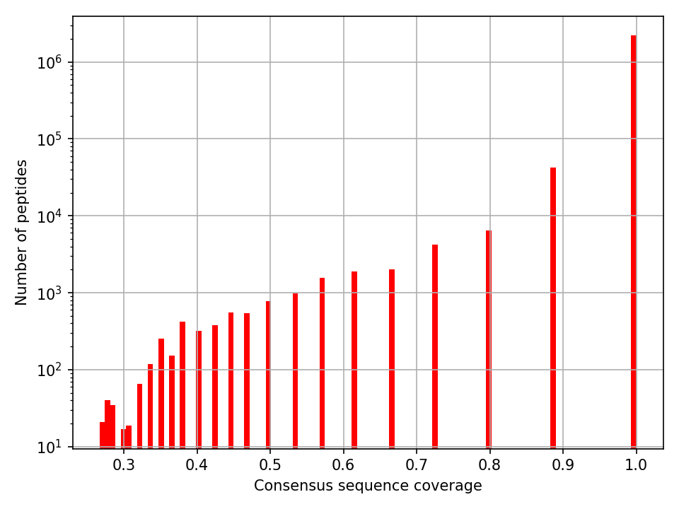
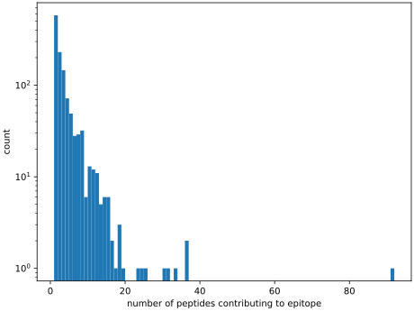
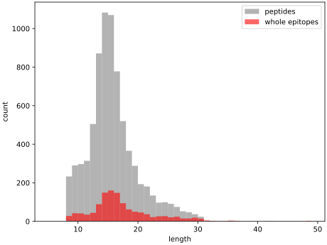
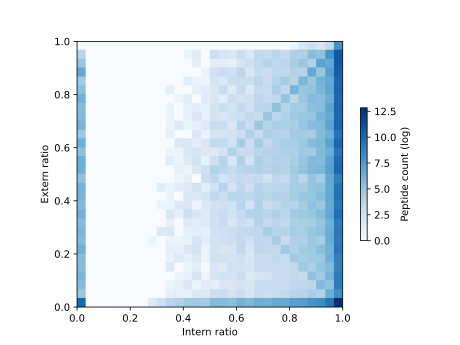
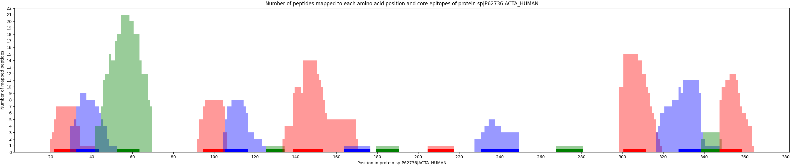

# Epicore
This tool is an adaption from [plateau](https://plateau.bcp.fu-berlin.de/)[1]. Epicore can be used to summarize nested sets of peptides and identify shared consensus sequences in immunopeptidomics datasets. 

## Installation
[](https://test.pypi.org/project/epicore/)
```bash
pip install epicore
```

Follow the [conda docs](https://github.com/AG-Walz/docs/tree/main/conda) to install conda. <br>

```bash
conda install bioconda::epicore
```

## How to use
To compute the peptide groups and consensus epitopes enter the following command:
```bash
epicore --reference_proteome <PROTEOME_FILE> --out_dir <OUT_DIR> \
  generate-epicore-csv \
    --min_epi_length <MIN_EPI_LENGTH> --min_overlap <MIN_OVERLAP>  \
    --max_step_size <MAX_STEP_SIZE> --seq_column <SEQ_COLUMN>  \
    --protacc_column <PROTACC_COLUMN> --delimiter <DELIMITER>  \
    --evidence_file <EVIDENCE_FILE> --start_column <START_COLUMN>  \
    --end_column <END_COLUMN> --sample_column  <SAMPLE_COLUMN>  \
    --condition_column <CONDITION_COLUMN> [--strict] [--included]  \
    [--mapping] [--QC] [--max_group_len <MAX_GROUP_LEN>]
```

Replace ```<EVIDENCE_FILE>``` with the path to your evidence file and ```<PROTEOME_FILE>``` with the path to a protein database containing all protein accessions included in the evidence file. You can find more detailed information about the input data [here](#input). This command runs epicore in default mode. Find out more about the different modes here [here](#workflow).

To visualize the landscape of a protein you can use the following command:
```bash
epicore --reference_proteome <PROTEOME_FILE> --out_dir <OUT_DIR>  \
  plot-landscape  \
    --epicore_csv <EPICORE_RESULT> --protacc <PROTACC>
```
Replace ```<EPICORE_RESULT>``` with the file epicore_result.csv, which can be generated by using the generate-epicore-csv command and ```<PROTEOME_FILE>``` with the protein database that was specified in the generate-epicore-csv command. Specify the protein you want to visualize after --protacc. Ensure that the protein accession is enclosed by quotation marks. 


### Input 
The description of all input parameters for the generate-epicore-csv command can be found in the table below. Parameters enclosed in square brackets are optional. The tool supports any output that contains a sequence, protein accession, sample and condition column. 
| Parameter | Default | Description |
| --- | --- | --- |
| <span style='opacity: 0.7;'>max_step_size</span> | 5 | Parameter for the default mode. Two peptides with a distance below the specified value are always assigned to one group. | 
| <span style='opacity: 0.7;'>min_overlap</span> | 9 | Parameter for all modes. It specifies the minimal overlap between two peptides to be assigned to the same group in default mode and the minimal required overlap between all peptides that are summarized in one group in strict mode. |
| <span style='opacity: 0.7;'>min_epi_length</span> | 11 | Parameter for all modes. It specifies the minimal length of identified consensus sequences. | 
| seq_column | None | Defines the column header in the input evidence file corresponding to the column containing the peptide sequences. |
| protacc_column | None | Defines the column header in the input evidence file corresponding to the column containing the protein accessions. |
| <span style='opacity: 0.7;'>start_column</span> | None | Defines the column header in the input evidence file corresponding to the column containing the peptide start positions. |
| <span style='opacity: 0.7;'>end_column</span> | None | Defines the column header in the input evidence file corresponding to the column containing the peptide end positions.|
| sample_column | None | Defines the column header in the input evidence file corresponding to the column containing the sample information.|
| condition_column | None | Defines the column header in the input evidence file corresponding to the column containing the condition information.|
| out_dir | None | Specifies the output directory. |
| delimiter | None | Defines the delimiter that separates multiple values in one cell in the input evidence file. |
| <span style='opacity: 0.7;'>strict</span> | not set | If set, a strict version is run. The strict version ensures the defined minimal overlap is given between all peptides in a peptide group. Peptides shorter than the specified minimal overlap are an exception. |
| <span style='opacity: 0.7;'>included</span> | not set | A version of the strict mode. If set, all strict mode peptide groups are extended by peptides that are included in the protein region of the group but not included in the group due to the min_overlap requirement between all peptides. |
| <span style='opacity: 0.7;'>QC</span> | not set | If set, two QC plots [consensus_sequence_coverage.png](#consensus_sequence_coveragesvg) and [intern_extern.svg](#intern_externsvg), are generated. |
| <span style='opacity: 0.7;'>mapping</span> | not set | If set, the [pep_cores_mapping](#pep_cores_mappingtsv) file is generated. |
| <span style='opacity: 0.7;'>html</span> | not set | If set, a html version of the generated plots gets computed.|
| <span style='opacity: 0.7;'>max_group_len</span> | None | If specified, the parameter ensures that all peptide groups have a length below the specified threshold. Peptides exceeding the defined length are an exception. |

For the plot-landscape command, --protacc specifies proteins for which a consensus landscape is visualized. Separate multiple parameters with commas. 

#### evidence file
The evidence file is the output file of a search engine. The following file types are supported: csv, tsv, xlsx.

#### proteome file
The proteome file should contain all proteins that appear in the protein accession column of the evidence file. The file has to be in FASTA format. 

### Output files
```
results of generate-epicore-csv
  |_consensus_sequence_coverage.png (optional)
  |_epicore.log
  |_epicore_result.csv
  |_epitope_intensity_hist.svg
  |_epitopes.csv
  |_intern_extern.svg (optional)
  |_length_distributions.svg
  |_pep_cores_mapping.tsv (optional)
```
The plot-landscape command results in protein landscape visualizations. One example can be found [here](#landscape-visualization). 

#### epicore.log
The log file contains information about the run. It lists all peptides that were removed due to missing accessions in the reference proteome. It also includes the number of identified peptide groups, specified parameters and the epicore version. 

#### epitopes.csv
The csv contains one epitope per row. 
| column | description |
| --- | --- |
| whole_epitopes | The sequence of the entire peptide group. |
| consensus_epitopes | The identified consensus sequence. |
| landscape | The landscape of the epitope. |
| grouped_peptides_sequence | A list containing the peptide sequences that contribute to peptide group. |
| grouped_peptides_sample | A list containing the samples of the peptides from the grouped_peptides_sequence column. |
| grouped_peptides_condition | A list containing the conditions of the peptides from the grouped_peptides_sequence column. |
| grouped_peptides_start | A list containing the start positions of the peptides from the grouped_peptides_sequence column. |
| grouped_peptides_end | A list containing the end positions of the peptides from the grouped_peptides_sequence column. |
| core_epitopes_start | The start position of the consensus sequence.|
| core_epitopes_end | The end position of the consensus sequence.|
| accession | A list containing the accessions of proteins in which the peptide group occurs. |


#### epicore_result.csv
The csv contains one protein per row. The different columns contain the following information: 
| column | description |
| --- | --- |
| accession | The protein accession. |
| sequence | A list of sequences of peptides mapped to the protein. |
| start | A list containing the start positions of the peptides in the protein. | 
| end | A list containing the end positions of the peptides in the protein. | 
| peptide_index | A list containing the row number of the peptides in the evidence file. | 
| sample | A list containing the sample of the peptides in the protein. | 
| condition | A list containing the condition of the peptides in the protein. | 
| grouped peptides start | The start positions of all peptides summarized into groups. |
| grouped peptides end | The end positions of all peptides summarized into groups. | 
| grouped peptides sequence | The peptide sequences summarized into peptide groups. |
| grouped peptides sample | The samples of all peptides summarized into groups. | 
| grouped peptides condition | The conditions of all peptides summarized into groups. | 
| landscape | A list containing the landscapes of each peptide group. | 
| whole_epitopes | A list containing the entire sequences of all peptide groups in the protein. | 
| consensus_epitopes | A list containing the consensus sequences of all peptide groups in the protein. | 
| core_epitopes_start | A list containing the start positions of the consensus sequences in the protein. |
| core_epitopes_end |  A list containing the end positions of the consensus sequences in the protein. |
| proteome_occurrence |  A list containing the occurrences of the consensus sequences in the protein.  |

#### pep_cores_mapping.tsv
The pep_cores_mapping.tsv contains all the information from the initial evidence file. In addition there are the following columns:
| column | description |
| --- | --- |
| entire_epitope_sequence | A list of all peptide groups to which the peptide of the row contributes.|
| consensus_epitope_sequence | A list of all consensus sequences to which the peptide of the row contributes.|
| proteome_occurrence | A list containing protein accessions and sequence positions at which the consensus epitope sequence occurs in the proteome. |

#### consensus_sequence_coverage.svg
A histogram that visualizes the consensus sequence coverage of all peptides. 
The consensus sequence coverage is defined for each peptide in a peptide group as the fraction of the consensus sequence that is covered by the peptide. <br>


#### epitope_intensity_hist.svg
The plot visualizes how many peptides contribute to each peptide group. <br>


#### length_distributions.svg
The plot visualizes the length distribution of the original peptides and the computed peptide groups. <br>


#### intern_extern.svg
The plot visualizes for each peptide the intern versus the extern ratio. The intern ratio is defined as the maximal overlap of a peptide with a peptides within the same group. The extern ratio is defined as the maximal overlap of a peptide with peptides of adjacent peptide groups.<br>


#### landscape visualization
An example landscape visualization of a protein generated with the plot-landscape command:<br>
<br>
The height indicates how many peptides are mapped to a position in the proteome. The different colors indicate different epitopes. Lighter areas of a color indicate how many peptides are associated with the epitope. The more intense region indicate the core epitope. 


## Workflow
1. Compute the positions of the peptides in the proteome if the positions are not provided in the input.
2. Group peptides based on their overlap. The following three modes are available: Strict, Included and Loose. The strict mode requires all peptides that are assigned to the same group to have a minimal shared overlap of min_overlap. When the included mode is specified the peptide groups are extended by peptides that are completely covered by the peptide group protein region. The loose mode (default) groups peptides when their start positions do not differ more than max_step_size or when their overlap is larger than min_overlap. max_step_size and min_overlap are parameters that can be specified by the user.
3. Only in the loose mode: Refine the peptide groups by splitting the peptide groups at positions where their landscape has a minimum.
4. Identify the consensus sequences of each peptide group. The consensus sequence is defined as the sequence region that has the highest landscape value while having a minimum length of min_epi_length. min_epi_length is a parameter that can be specified by the user.

## Citation
Epicore is an adaption from the tool developed by Álvaro-Benito et al.[1].<br>
[1] Álvaro-Benito, Miguel, et al. "Quantification of HLA-DM-dependent major histocompatibility complex of class II immunopeptidomes by the peptide landscape antigenic epitope alignment utility." Frontiers in immunology 9 (2018): 872.
